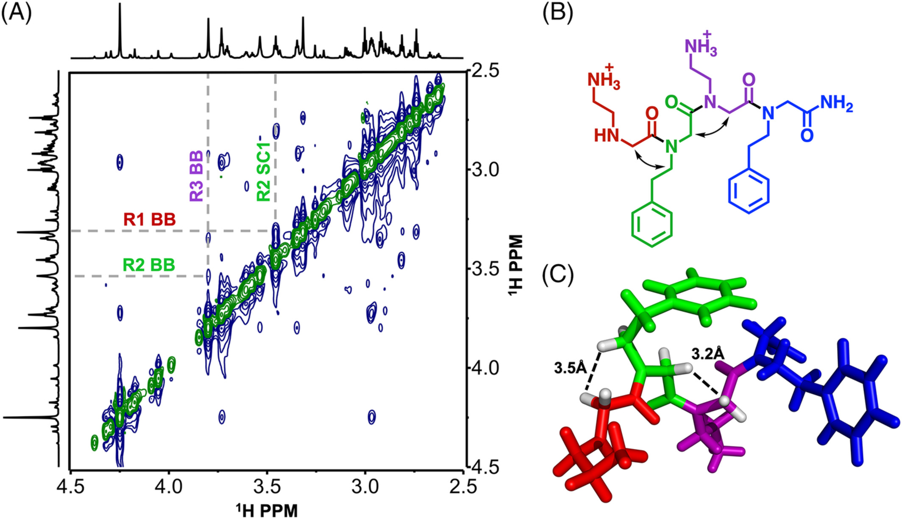

# peptoid_ESM
This repository is to compare the Enhance Sampling Methods of peptoid 19AE1-4-A in Systematic and Extensible force field for Peptoids (STEPs)

### 19AE1-4-A/
This foder contain the topology of 19AE1-4-A code in [Peptoid Data Bank](https://databank.peptoids.org/)
* [19AE1-4-A](https://databank.peptoids.org/peptoid/19AE1-4-A) - An Unconstrained Linear Tetramer in water.  Ref: [Roe et al. Biopolymers 2019](https://doi.org/10.1002/bip.23267)
* Solution: Water
* Water Model: TIP3P
* Force Field: [STEPs](https://pubs.acs.org/doi/10.1021/acs.jpcb.3c01424)
* Simulation Package: GROMACS
* Prepared by: Bradely & Marcel

### HREX/
Open change the torsional potential and do the Hamiltonian Replica Exchange at constant temperature
* Prepared by: Starwing & Vince 

### Enhanced_Emsemble/

* Prepared by: Starwing & Vince

### REDs/

* Prepared by: Steven

### Metadynamics/

* Prepared by: Bradely & Marcel